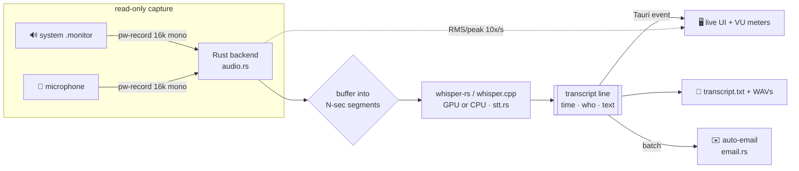

<div align="center">

# 🎙️ BigTranscriber

**Live, 100 % offline speech-to-text for online hearings — system audio *and* microphone, GPU-accelerated, with optional auto-email.**

*Transcrição ao vivo e 100 % offline de audiências online — áudio do sistema **e** microfone, acelerada por GPU, com envio automático por e-mail.* 🇧🇷

[](LICENSE)
[](#-install)
[](https://tauri.app)
[](https://www.rust-lang.org)
[](https://github.com/ggerganov/whisper.cpp)

</div>

---

BigTranscriber listens to **everything you hear** (a Microsoft Teams hearing, a
browser, a call…) **and your microphone**, and produces a live, timestamped,
speaker-labelled transcript. Nothing leaves your machine: transcription runs
locally with [whisper.cpp](https://github.com/ggerganov/whisper.cpp) via
[`whisper-rs`](https://github.com/tazz4843/whisper-rs), compiled **into** the app.

| Channel | Source | Default label |
|--------|--------|:---:|
| 🔊 System audio | a sink's `.monitor` (the other party, witness, court…) | `OUTROS` |
| 🎤 Microphone | your input device (you) | `EU` |

Each finalized line is shown live, appended to `transcript.txt`, and — if you
enable it — **e-mailed to you automatically** every *N* minutes and/or *N* lines.

## ✨ Features

- 🔒 **100 % offline & private** — audio never leaves the machine; no cloud, no API keys.
- ⚡ **GPU-accelerated (Vulkan)** — `large-v3` runs **well above real time** on a modern GPU; CPU-only builds also available.
- 🗣️ **Two channels, one transcript** — system audio + mic, interleaved and speaker-labelled.
- 📈 **Live input VU meters** — confirm each channel is actually picking up sound.
- ✉️ **Auto-email** — mail the running transcript to yourself every *N* minutes / *N* lines (via your own Gmail OAuth helper).
- 🎚️ **Non-disruptive capture** — read-only; never changes your audio defaults, devices, or Bluetooth.
- 🧩 **Self-contained** — inference is in-process; no Python, no server, no sidecar for the core app.

## 🧠 How it works



`pw-record` (read-only) streams each source as 16 kHz mono PCM into the Rust
backend, which buffers it into segments, runs `whisper-rs` per channel, writes
`transcript.txt` + backup WAVs, emits each line to the UI over a Tauri event, and
optionally batches lines for e-mail. The frontend (`dist/`) is plain HTML/JS; the
backend (`src-tauri/src/`) is `main.rs` (commands/state), `audio.rs` (capture +
metering), `stt.rs` (whisper), `email.rs` (batching + delivery).

## 📦 Install

### Pre-built packages (Releases)

Grab the latest from the [**Releases**](../../releases) page:

| OS | File | Notes |
|----|------|-------|
| 🐧 Ubuntu 24.04+ | `.deb` | `sudo apt install ./BigTranscriber_*.deb` |
| 🐧 Any Linux (incl. **BigLinux**) | `.AppImage` | `chmod +x *.AppImage && ./BigTranscriber*.AppImage` |
| 🪟 Windows 10/11 | `.exe` (NSIS setup) | run the installer |

> Release binaries are **CPU-only** for portability. For **GPU (Vulkan)** speed,
> build from source (below) or use the BigLinux `PKGBUILD`.

### BigLinux / Arch (native, GPU)

```bash
git clone https://github.com/podheitor/BigTranscriber.git
cd BigTranscriber
makepkg -si            # builds the GPU (Vulkan) package and installs it
./scripts/get-model.sh large-v3
```

### Build from source (GPU, Vulkan)

Needs: Rust, `cargo-tauri`, `webkit2gtk-4.1`, a C++ toolchain, `cmake`, the Vulkan
loader (`libvulkan.so`) and `glslc`. No CUDA toolkit and no extra system packages
are installed — `scripts/build.sh` fetches a header-only Vulkan SDK into
`.vulkan-sdk/` and wires it up.

```bash
git clone https://github.com/podheitor/BigTranscriber.git
cd BigTranscriber
./scripts/get-model.sh large-v3     # download the speech model (curl, no Python)
./scripts/build.sh                  # first build compiles whisper.cpp + shaders
```

After the first `./scripts/build.sh`, plain `cargo build --release` and
`cargo tauri dev` work too (paths are remembered in `src-tauri/.cargo/config.toml`).
For a **CPU-only** build: `cargo build --release --no-default-features`.

## ▶️ Run

```bash
# GUI:
./src-tauri/target/release/bigtranscriber
# or during development:
cd src-tauri && cargo tauri dev
```

In the window:

1. **Áudio do sistema** (monitor of what you hear) and **Microfone** are each
   preselected. Use the **checkbox** on each to turn that channel on/off — e.g.
   untick *Áudio do sistema* to transcribe only your mic.
2. Pick the **model** and **idioma** (Português by default). Lower **Segmento (s)**
   for snappier live text (default 4 s; a GPU handles 2–3 s fine).
3. Click **● Iniciar**. The **VU meters** next to `OUTROS`/`EU` show live input
   level. **■ Parar** finalizes and saves.

Output lands in `recordings/<timestamp>/`:

```
transcript.txt    system.wav    mic.wav
```

> **One voice, doubled?** On speakers, your mic also hears the system audio, so the
> same speech shows up on *both* `EU` and `OUTROS`. Use **headphones**, or untick
> whichever channel you don't need.

## ✉️ Auto-email setup

The auto-email feature shells out to a small **Gmail API (OAuth)** helper so mail
is sent genuinely *From* your Gmail — no SMTP password stored. A reference helper
ships at [`scripts/send_gmail.py`](scripts/send_gmail.py).

1. Create an OAuth Desktop client in Google Cloud, enable the Gmail API, authorize
   the scope `gmail.send`, and save the token JSON privately.
2. `pip install google-api-python-client google-auth`
3. Point the app at your helper + token:

| Env var | Meaning | Default |
|---|---|---|
| `BIGTRANSCRIBER_GMAIL_PY` | path to the sender script | `scripts/send_gmail.py` |
| `BIGTRANSCRIBER_GMAIL_PYTHON` | python interpreter with the Google libs | `python3` |
| `GMAIL_TOKEN` | OAuth token JSON | `~/.config/bigtranscriber/gmail_token.json` |
| `GMAIL_FROM` | sending address | the token's account |
| `BIGTRANSCRIBER_EMAIL_REPLYTO` | optional Reply-To | *(none)* |

Then tick **“Enviar transcrição por e-mail automaticamente”**, set minutes and/or
lines (`0` disables a trigger), and use **Enviar agora** to flush on demand.
Sending runs on its own thread, so a slow network never stalls transcription.

## 🛠️ CLI helpers (no GUI)

```bash
BIN=src-tauri/target/release/bigtranscriber
# Re-transcribe a saved recording:
$BIN transcribe models/ggml-large-v3.bin recordings/<ts>/system.wav
# 15 s live capture test from the default mic:
$BIN live models/ggml-large-v3.bin "" 15
# Show which GPU is used + speed:
BT_VERBOSE=1 $BIN transcribe models/ggml-large-v3.bin some.wav
```

## 🚀 Performance & tips

- **GPU (Vulkan).** `large-v3` measured at **~14× real time** on an RTX 5060 Ti.
  It uses your existing Vulkan loader + `glslc`; set `BIGTRANSCRIBER_GPU=N` to pick
  a specific Vulkan device.
- **Latency** ≈ the *Segmento* value (default 4 s): the transcript trails live audio
  by about one segment. Shorter = snappier but slightly less context/accuracy.
- **Model choice.** `large-v3` = best accuracy (easily real-time on GPU);
  `medium`/`small`/`base` trade accuracy for speed and are handy on CPU.
- **Headphones** keep `EU`/`OUTROS` cleanly separated.

## ⚖️ Privacy & legal

Capture is **read-only** and everything stays on your machine. That is a *separate*
question from whether you are **allowed** to record.

> ⚠️ **Confirm recording is permitted before you record a hearing.** Court rules on
> recording vary by jurisdiction. Check first.

## 🧱 Tech stack

[Tauri 2](https://tauri.app) · [Rust](https://www.rust-lang.org) ·
[whisper.cpp](https://github.com/ggerganov/whisper.cpp) /
[whisper-rs](https://github.com/tazz4843/whisper-rs) · Vulkan · PipeWire (`pw-record`)

## 📄 License

[GNU Affero General Public License v3.0](LICENSE) © Heitor Faria.
Includes/links third-party components under their own licenses (whisper.cpp — MIT).
